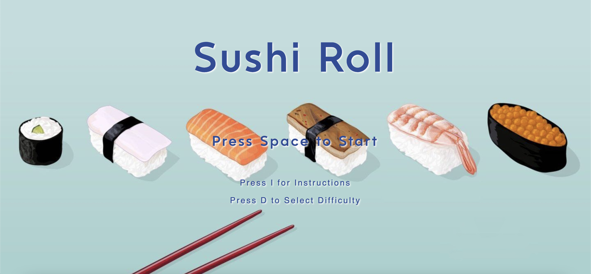
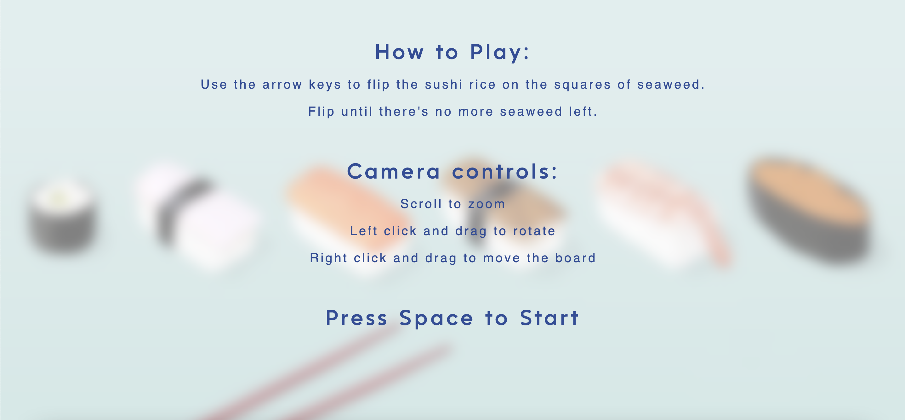
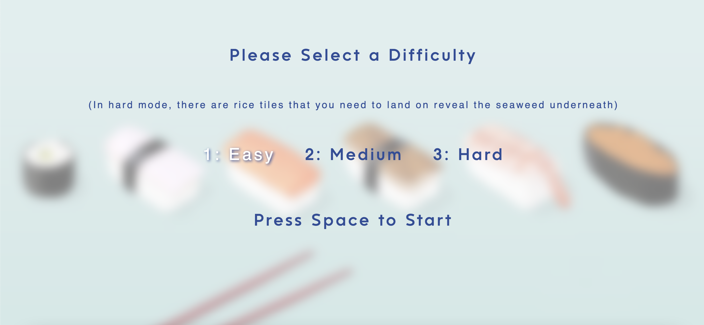
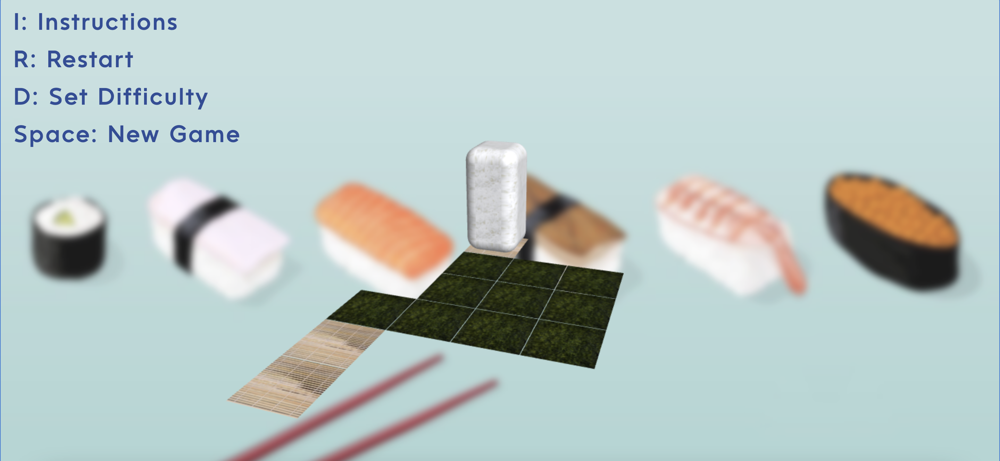
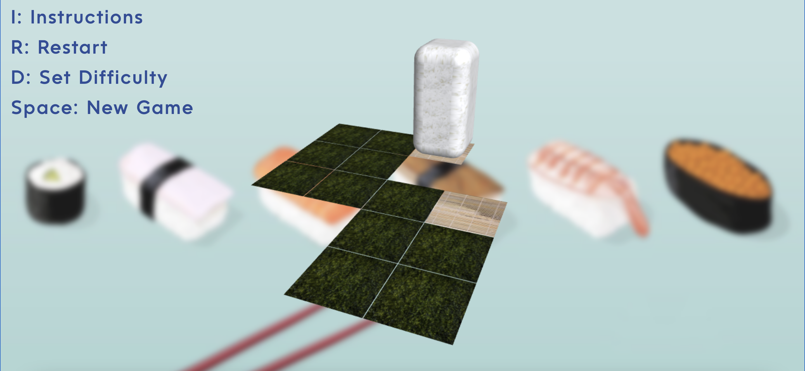
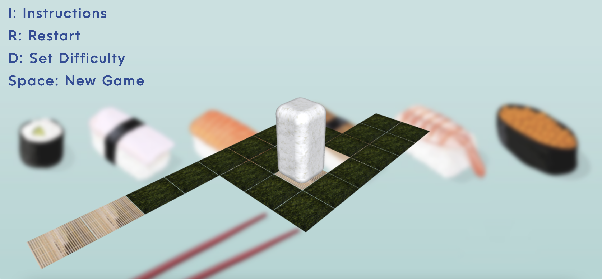
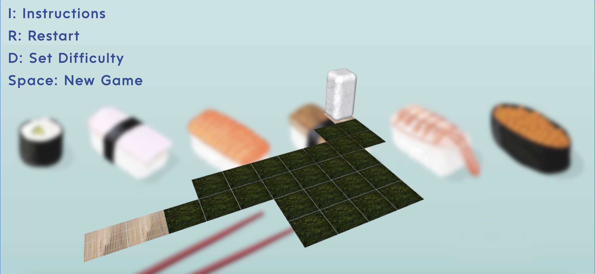
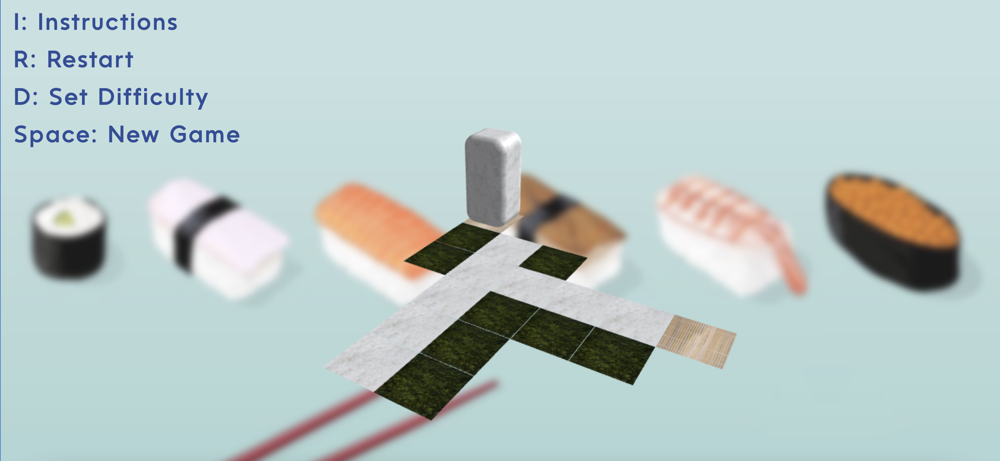
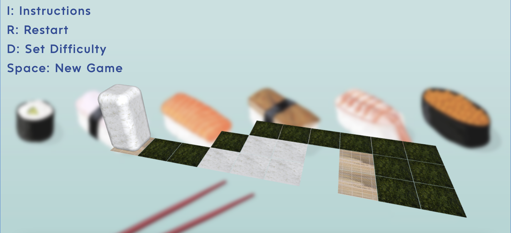
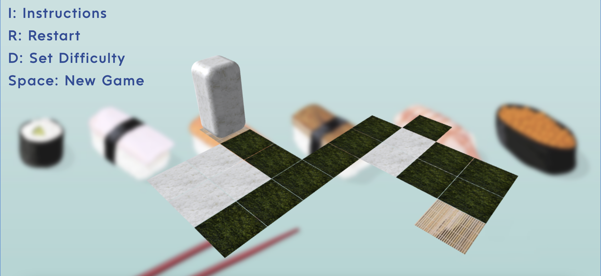

# SushiRoll

Sushi Roll is an online puzzle game where the player rolls sushi rice on squares of seaweed to create sushi rolls. In this game, each puzzle is procedurally generated. This means there's an infinite number of challenging puzzles of varying difficulties for you to play!

# [Play Sushi Roll here!](https://angelaxi.github.io/SushiRoll/)

## Gameplay Rules and Design

In Sushi Roll, the player uses the arrow keys to flip the sushi rice on the squares of seaweed to get to the bamboo mat. The rice can't go off the board of seaweed squares, and the it must land on each square of seaweed before landing on the bamboo mat. After moving off a seaweed square, it will disappear. 

The player can select various difficulties for the game and the board will be generated accordingly.
In easy mode, there are less squares of seaweed the player has to land on. In medium mode, there are more squares of seaweed. In hard mode, there are squares of rice the player needs to land on to reveal the seaweed underneath.

### Example Puzzles

I used a random walk algorithm to generate each puzzle. Since the shape of sushi rice isn't a cube, I had to keep track of the orientation of the rice block at all times while using the random walk algorithm.

##### Easy Mode:

##### Medium Mode:

#### Hard Mode:

